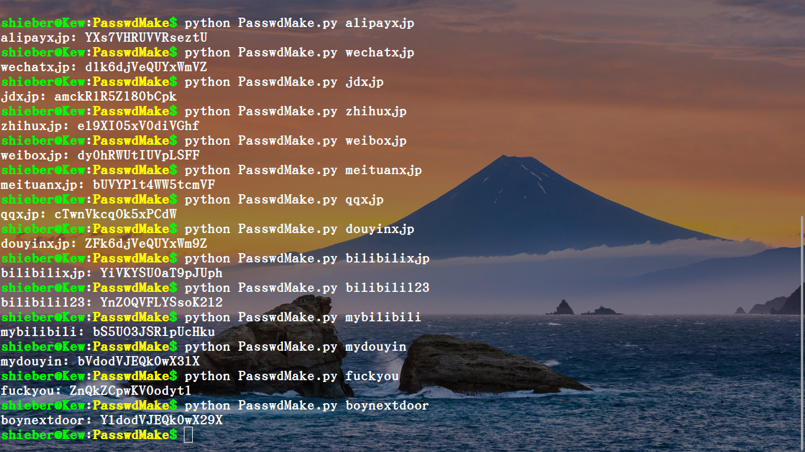

# PasswdMake
:experimental:
:author: 'Shieber'
:date: '2020.07.31'

CAUTION: [link:README_CN.adoc[中文]] Make a password for any account via a seed.

NOTE: Usage1

[source, shell]
.bash
----
    $ python PasswdMake.py seed
    $ python PasswdMake.py alipayxjp
    $ python PasswdMake.py wechatxjp
    $ python PasswdMake.py zhihuxjp
    $ python PasswdMake.py weiboxjp
----

NOTE: Usage2 [Add PasswdMake.py to /usr/local/bin]

[source, shell]
.bash
-----
    $ mv PasswdMake.py PasswdMake
    $ chmod +x PasswdMake
    $ sudo mv PasswdMake /usr/local/bin
    $ PasswdMake seed
-----

TIP: Example

TIP: use pass to save the long and complex password as below

[source, shell]
.bash
-----
    $ sudo apt install pass
-----

