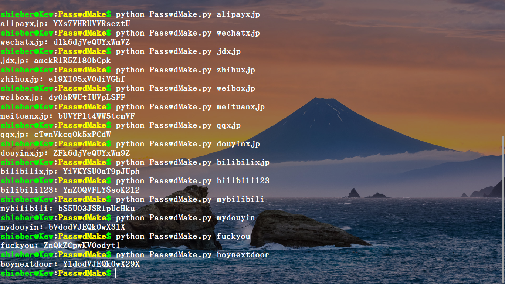
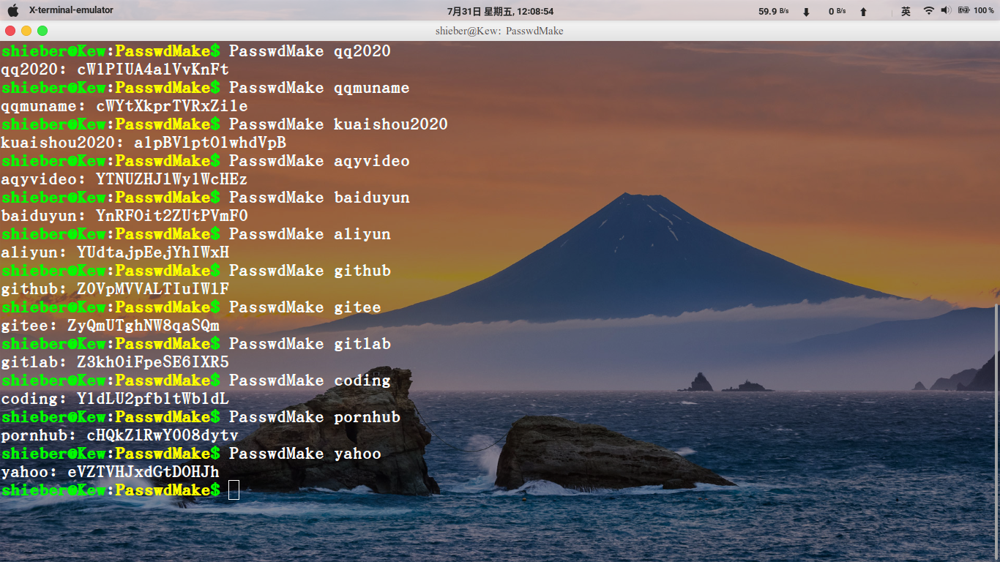

# PasswdMake
:experimental:
:author: 'Shieber'
:date: '2020.07.31'

### [link:README.adoc[English]] 输入各种账号的seed以生成密码，seed可以是账户种类加姓名或数字等。

### 用法1

[source, shell]
.bash
----
    $ python PasswdMake.py seed
    $ python PasswdMake.py alipayxjp #账号为支付宝，xjp为缩写
    $ python PasswdMake.py wechatxjp
    $ python PasswdMake.py zhihuxjp
    $ python PasswdMake.py weiboxjp
----

### 用法2 [添加 PasswdMake.py 到/usr/local/bin]

[source, shell]
.bash
-----
    $ mv PasswdMake.py PasswdMake
    $ chmod +x PasswdMake
    $ sudo mv PasswdMake /usr/local/bin
    $ PasswdMake seed  #命令行直接生成密码，省去用法1中冗长语法
-----

### 两种用法示例，左侧为输入的seed，右侧为密码，可见，密码非常丰富，极难重复

这么长和复杂的密码如何保存？使用pass工具，安装如下。用pass保存PasswdMake生成的密码，以后要用时，再用pass输出密码，用pass -c account 还可保存密码到剪切板以直接粘贴到登录框。

[source, shell]
.bash
-----
    $ sudo apt install pass
-----

我的密码都是这么管理的，我也不知道我的微信，知乎，京东的密码到底是多少，反正要用就用pass显示。
